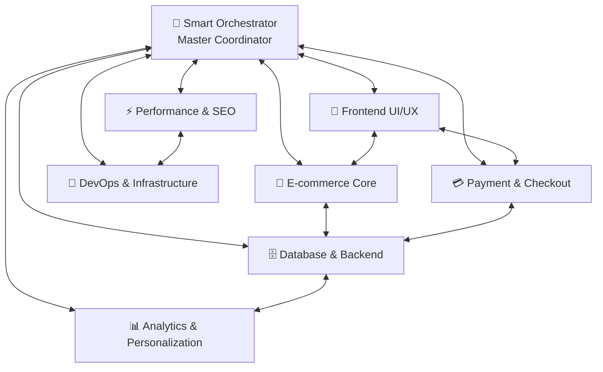

# 🤖 RavoActive Intelligence Network

This directory contains the RavoActive Intelligence Network - a sophisticated system of specialized AI agents that collaborate to deliver enterprise-level e-commerce solutions. Each agent maintains specialized expertise while contributing to a unified, intelligent development ecosystem.

## 🧠 Core Network Components

| Agent | Domain | Expertise | Use Cases |
|-------|--------|-----------|-----------|
| **[🧠 Smart Orchestrator](./smart-orchestrator-agent.md)** | **Master Coordinator** | Multi-agent workflows, architectural decisions | Complex feature coordination, system integration |
| **[🎨 Frontend UI/UX](./frontend-uiux-agent.md)** | Component Development | React, Next.js, Tailwind, Animations | Building components, animations, responsive design |
| **[🛒 E-commerce Core](./ecommerce-core-agent.md)** | Shopping Features | Product catalogs, cart, search, recommendations | Shopping cart, product pages, filtering |
| **[💳 Payment & Checkout](./payment-checkout-agent.md)** | Payment Processing | Stripe, PayPal, checkout optimization | Payment flows, order processing |
| **[🗄️ Database & Backend](./database-backend-agent.md)** | Data Architecture | PostgreSQL, Prisma, APIs, caching | Database design, API development |
| **[⚡ Performance & SEO](./performance-seo-agent.md)** | Optimization | Core Web Vitals, SEO, speed | Performance tuning, SEO optimization |
| **[📊 Analytics & Personalization](./analytics-personalization-agent.md)** | User Insights | GA4, A/B testing, ML recommendations | Analytics, personalization, testing |
| **[🚀 DevOps & Infrastructure](./devops-infrastructure-agent.md)** | Deployment | CI/CD, monitoring, scaling | Deployment, monitoring, infrastructure |

## 🕸️ Intelligence Network Features

### **[📚 Intelligence Network Documentation](./intelligence-network.md)**
Complete documentation of how agents collaborate, communicate, and coordinate to deliver superior results.

### **Network Architecture**


### **Intelligent Collaboration Patterns**
- **🔄 Cascade Communication**: Top-down architectural decisions
- **🤝 Peer-to-Peer**: Direct specialist collaboration  
- **🎯 Expert Consultation**: Specialized knowledge requests
- **⚡ Emergency Response**: Crisis coordination protocols

## 🚀 How to Use the Intelligence Network

### **Method 1: Smart Orchestrator (Recommended for Complex Tasks)**
For multi-domain features or complex implementations:

```
You are the Smart Orchestrator for RavoActive. You coordinate between specialized agents to deliver cohesive e-commerce solutions. 

For the request: "Implement personalized product recommendations with analytics tracking", please:
1. Analyze complexity and identify required agents  
2. Create a coordinated workflow with clear dependencies
3. Provide specific instructions for each involved agent
4. Establish success criteria and integration points
```

### **Method 2: Direct Agent Activation (For Specialized Tasks)**
For domain-specific work:

```
You are the Frontend UI/UX Agent for RavoActive. Your expertise includes modern React/Next.js patterns, Tailwind CSS advanced techniques, and Framer Motion animations matching Nike/Adidas quality.

Create a product detail page component with image gallery, size selection, and smooth animations.
```

### **Method 3: Network Consultation (For Expert Guidance)**
When you need multiple perspectives:

```
I need expert consultation from the RavoActive Intelligence Network on optimizing our checkout conversion rate. Please coordinate between relevant agents to provide comprehensive recommendations.
```

## 🎯 Request Routing Guide

### **Simple Requests (Single Agent)**
- **UI components** → Frontend UI/UX Agent
- **Database queries** → Database & Backend Agent  
- **Payment integration** → Payment & Checkout Agent
- **SEO optimization** → Performance & SEO Agent

### **Complex Requests (Smart Orchestrator + Multiple Agents)**
- **New feature development** → Smart Orchestrator coordinates all relevant agents
- **Performance optimization** → Smart Orchestrator + Performance, Frontend, Backend agents
- **System integration** → Smart Orchestrator manages cross-domain coordination

### **Critical Requests (Full Network Activation)**
- **Security incidents** → All agents coordinate emergency response
- **Major architecture changes** → Network-wide collaboration
- **Product launches** → Complete system coordination

## 📊 Network Intelligence Features

### **🔮 Predictive Collaboration**
The network learns from past projects to predict optimal agent combinations and workflows.

### **🎯 Context-Aware Routing** 
Automatic routing of requests to the most appropriate agents based on complexity and domain requirements.

### **⚡ Adaptive Learning**
Continuous improvement of collaboration patterns based on project outcomes and feedback.

### **🛡️ Quality Assurance**
Built-in quality gates and cross-agent validation to ensure enterprise-grade deliverables.

## 🔄 Collaboration Workflows

### **Feature Development Workflow**
```
1. 🧠 Smart Orchestrator → Requirements analysis & agent coordination
2. 🎨 Frontend UI/UX + 🛒 E-commerce Core → Design collaboration  
3. 🗄️ Database & Backend → Implementation foundation
4. ⚡ Performance & SEO + 📊 Analytics → Optimization & tracking
5. 🚀 DevOps & Infrastructure → Deployment & monitoring
```

### **Performance Optimization Workflow**  
```
1. ⚡ Performance & SEO → Performance audit & bottleneck identification
2. 🎨 Frontend UI/UX → Component & asset optimization
3. 🗄️ Database & Backend → Query & API optimization  
4. 🚀 DevOps & Infrastructure → Infrastructure scaling
5. 📊 Analytics → Performance monitoring & validation
```

### **Security Response Workflow**
```
1. 🧠 Smart Orchestrator → Incident coordination & communication
2. 💳 Payment & Checkout → Security assessment & containment
3. 🗄️ Database & Backend → Data protection & access control
4. 🚀 DevOps & Infrastructure → Infrastructure hardening
5. All Agents → Comprehensive security validation
```

## 🎨 Best Practices for Network Usage

### **For Simple Tasks**
1. **Identify the domain** (UI, backend, payments, etc.)
2. **Use the specialist agent directly** for focused expertise
3. **Reference agent guidelines** for consistency

### **For Complex Features**
1. **Start with Smart Orchestrator** for coordination
2. **Follow the recommended workflow** from orchestration
3. **Maintain communication** between agents during implementation
4. **Validate integration points** across domains

### **For System-Wide Changes**
1. **Engage the full network** through Smart Orchestrator
2. **Plan in phases** with clear handoff points
3. **Implement quality gates** at each phase
4. **Document decisions** for future reference

## 🆘 Getting Expert Help

### **Unsure Which Agent to Use?**
```
I need help with [describe your task]. Which agent or combination of agents should I work with?
```

### **Need Architecture Guidance?**
```
As the Smart Orchestrator, please provide architectural guidance for [your system/feature]. Consider scalability, performance, and maintainability.
```

### **Want Comprehensive Analysis?**
```
Please conduct a comprehensive analysis of [your system/issue] using the full intelligence network and provide coordinated recommendations.
```

## 📈 Network Evolution

The RavoActive Intelligence Network continuously evolves through:
- **Learning from project outcomes**
- **Adapting to new technologies and patterns**
- **Incorporating user feedback and preferences**  
- **Optimizing collaboration efficiency**

---

*The RavoActive Intelligence Network represents the future of AI-assisted development - where specialized expertise combines with intelligent coordination to deliver enterprise-grade e-commerce solutions.*