# 🕸️ RavoActive Intelligence Network

## Network Overview

The RavoActive Intelligence Network is a sophisticated system of interconnected AI agents that collaborate to deliver enterprise-level e-commerce solutions. Each agent maintains specialized expertise while contributing to a unified, intelligent development ecosystem.

## Network Architecture

### **Core Network Topology**

```mermaid
graph TB
    subgraph "Intelligence Network"
        SO[🧠 Smart Orchestrator<br/>Master Coordinator]
        
        subgraph "Frontend Layer"
            FE[🎨 Frontend UI/UX<br/>Component & Design Expert]
        end
        
        subgraph "Business Logic Layer"
            EC[🛒 E-commerce Core<br/>Shopping Experience Expert]
            PC[💳 Payment & Checkout<br/>Transaction Expert]
        end
        
        subgraph "Data Layer"
            DB[🗄️ Database & Backend<br/>Architecture Expert]
            AP[📊 Analytics & Personalization<br/>Intelligence Expert]
        end
        
        subgraph "Infrastructure Layer"
            PS[⚡ Performance & SEO<br/>Optimization Expert]
            DI[🚀 DevOps & Infrastructure<br/>Operations Expert]
        end
    end
    
    %% Orchestrator connections (bidirectional)
    SO <--> FE
    SO <--> EC
    SO <--> PC
    SO <--> DB
    SO <--> AP
    SO <--> PS
    SO <--> DI
    
    %% Inter-layer connections
    FE <--> EC
    FE <--> PC
    FE <--> PS
    
    EC <--> DB
    EC <--> AP
    PC <--> DB
    
    DB <--> AP
    DB <--> DI
    PS <--> DI
    
    %% Cross-layer collaborations
    FE -.-> AP
    EC -.-> PS
    PC -.-> DI
    AP -.-> PS
```



### **Agent Specialization Matrix**

| **Domain** | **Primary Agent** | **Secondary Agents** | **Expertise Level** |
|------------|-------------------|---------------------|---------------------|
| **User Interface** | Frontend UI/UX | Performance & SEO | Expert → Advanced |
| **Shopping Experience** | E-commerce Core | Frontend UI/UX, Analytics | Expert → Advanced |
| **Transaction Processing** | Payment & Checkout | Database & Backend | Expert → Advanced |
| **Data Architecture** | Database & Backend | E-commerce Core | Expert → Advanced |
| **User Intelligence** | Analytics & Personalization | E-commerce Core, Database | Expert → Advanced |
| **System Performance** | Performance & SEO | Frontend UI/UX, DevOps | Expert → Advanced |
| **Infrastructure** | DevOps & Infrastructure | Database & Backend | Expert → Advanced |

## Intelligence Protocols

### **Knowledge Sharing Framework**

```typescript
interface KnowledgeExchange {
  source: AgentType
  target: AgentType | AgentType[]
  knowledgeType: 'technical' | 'business' | 'performance' | 'security'
  priority: 'immediate' | 'standard' | 'background'
  payload: {
    context: string
    data: any
    recommendations: string[]
    concerns: string[]
  }
  expectedOutcome: string
}

// Example knowledge exchange
const performanceInsight: KnowledgeExchange = {
  source: "Performance & SEO",
  target: ["Frontend UI/UX", "Database & Backend"],
  knowledgeType: "performance",
  priority: "standard",
  payload: {
    context: "Product page loading optimization",
    data: {
      currentLCP: "3.2s",
      targetLCP: "2.5s",
      bottlenecks: ["large images", "database queries"]
    },
    recommendations: [
      "Implement lazy loading for below-fold images",
      "Add database query caching for product data"
    ],
    concerns: [
      "Image optimization may affect visual quality",
      "Caching strategy needs cache invalidation logic"
    ]
  },
  expectedOutcome: "LCP improvement to < 2.5s within 1 week"
}
```

### **Collaborative Decision Making**

```typescript
interface CollaborativeDecision {
  initiator: AgentType
  participants: AgentType[]
  decisionType: 'architectural' | 'implementation' | 'optimization' | 'security'
  context: {
    problem: string
    constraints: string[]
    requirements: string[]
    timeline: string
  }
  proposals: AgentProposal[]
  consensus: ConsensusResult
  implementation: ImplementationPlan
}

interface AgentProposal {
  agent: AgentType
  solution: string
  pros: string[]
  cons: string[]
  effort: 'low' | 'medium' | 'high'
  risk: 'low' | 'medium' | 'high'
  dependencies: string[]
}
```

## Network Communication Patterns

### **Pattern 1: Cascade Communication**
Used for top-down decisions and architectural changes.

```typescript
const cascadePattern = {
  trigger: "Smart Orchestrator",
  flow: [
    "Smart Orchestrator → All Agents (broadcast)",
    "Primary Agents → Secondary Agents (targeted)",
    "Secondary Agents → Smart Orchestrator (feedback)"
  ],
  useCase: "Architecture changes, new feature announcements"
}
```

### **Pattern 2: Peer-to-Peer Collaboration**
Used for direct collaboration between specialist agents.

```typescript
const peerToPeerPattern = {
  trigger: "Any specialist agent",
  flow: [
    "Agent A → Agent B (direct communication)",
    "Agent B → Agent A (response)",
    "Both → Smart Orchestrator (status update)"
  ],
  useCase: "Technical consultations, implementation details"
}
```

### **Pattern 3: Expert Consultation**
Used when specialized knowledge is needed.

```typescript
const expertConsultationPattern = {
  trigger: "Agent with question",
  flow: [
    "Requesting Agent → Smart Orchestrator (consultation request)",
    "Smart Orchestrator → Expert Agent (consultation routing)",
    "Expert Agent → Requesting Agent (expert guidance)",
    "Smart Orchestrator (monitoring and documentation)"
  ],
  useCase: "Technical challenges, best practice guidance"
}
```

## Network Intelligence Features

### **1. Predictive Collaboration**
The network learns from past collaborations to predict future needs.

```typescript
interface PredictiveCollaboration {
  triggers: {
    featureType: string
    agentCombinations: AgentType[]
    successPatterns: CollaborationPattern[]
    riskFactors: string[]
  }
  
  predictions: {
    requiredAgents: AgentType[]
    criticalPath: string[]
    estimatedEffort: string
    potentialBlockers: string[]
  }
  
  recommendations: {
    optimalWorkflow: WorkflowStep[]
    riskMitigation: MitigationStrategy[]
    qualityGates: QualityGate[]
  }
}
```

### **2. Adaptive Learning System**
The network continuously improves based on outcomes.

```typescript
interface AdaptiveLearning {
  learningInputs: {
    projectOutcomes: OutcomeData[]
    collaborationEffectiveness: EffectivenessMetrics
    agentPerformance: PerformanceMetrics[]
    userFeedback: FeedbackData[]
  }
  
  adaptations: {
    workflowOptimizations: WorkflowImprovement[]
    agentSpecializations: SpecializationUpdate[]
    communicationPatterns: PatternOptimization[]
    qualityStandards: StandardUpdate[]
  }
}
```

### **3. Context-Aware Routing**
Smart routing of requests based on context and agent availability.

```typescript
interface ContextAwareRouting {
  contextAnalysis: {
    requestComplexity: 'simple' | 'moderate' | 'complex' | 'critical'
    domainExpertise: ExpertiseRequirement[]
    urgency: 'low' | 'medium' | 'high' | 'critical'
    businessImpact: 'low' | 'medium' | 'high' | 'critical'
  }
  
  routingLogic: {
    primaryAgent: AgentType
    supportingAgents: AgentType[]
    workflow: WorkflowType
    escalationPath: EscalationPath
  }
  
  optimization: {
    loadBalancing: LoadBalancingStrategy
    resourceAllocation: ResourceAllocation
    timelineOptimization: TimelineStrategy
  }
}
```

## Real-World Collaboration Scenarios

### **Scenario 1: E-commerce Feature Development**

#### **Product Recommendation Engine Implementation**

```typescript
const recommendationEngineProject = {
  phase1_requirements: {
    orchestrator: {
      role: "Project coordinator and requirements analysis",
      deliverables: ["Project specification", "Agent assignments", "Timeline"]
    }
  },
  
  phase2_design: {
    ecommerceCore: {
      role: "Business logic and recommendation algorithms",
      deliverables: ["Algorithm specifications", "Business rules"],
      collaborates_with: ["Analytics & Personalization"]
    },
    analyticsPersonalization: {
      role: "ML models and user behavior analysis", 
      deliverables: ["ML pipeline design", "User segmentation"],
      collaborates_with: ["E-commerce Core", "Database & Backend"]
    },
    databaseBackend: {
      role: "Data architecture and API design",
      deliverables: ["Schema design", "API specifications"],
      collaborates_with: ["Analytics & Personalization"]
    }
  },
  
  phase3_implementation: {
    databaseBackend: {
      role: "Backend implementation and API development",
      deliverables: ["APIs", "Database implementation", "ML pipeline"],
      dependencies: ["phase2_design"]
    },
    frontendUIUX: {
      role: "UI components and user experience",
      deliverables: ["Recommendation components", "User interfaces"],
      dependencies: ["phase2_design", "databaseBackend APIs"]
    }
  },
  
  phase4_optimization: {
    performanceSEO: {
      role: "Performance optimization and SEO",
      deliverables: ["Performance optimizations", "SEO enhancements"],
      collaborates_with: ["Frontend UI/UX", "Database & Backend"]
    },
    analyticsPersonalization: {
      role: "A/B testing and optimization",
      deliverables: ["Testing framework", "Performance metrics"],
      collaborates_with: ["Frontend UI/UX"]
    }
  },
  
  phase5_deployment: {
    devopsInfrastructure: {
      role: "Deployment and monitoring",
      deliverables: ["Production deployment", "Monitoring setup"],
      collaborates_with: ["All agents for deployment validation"]
    }
  }
}
```

### **Scenario 2: Performance Crisis Response**

#### **Site Performance Degradation**

```typescript
const performanceCrisisResponse = {
  immediate_response: {
    orchestrator: {
      role: "Crisis coordination and communication",
      actions: ["Assess impact", "Coordinate response", "Stakeholder communication"],
      timeline: "0-15 minutes"
    },
    performanceSEO: {
      role: "Performance analysis and diagnosis",
      actions: ["Identify bottlenecks", "Performance measurement", "Root cause analysis"],
      timeline: "0-30 minutes",
      collaborates_with: ["DevOps & Infrastructure"]
    }
  },
  
  diagnosis_phase: {
    devopsInfrastructure: {
      role: "Infrastructure analysis",
      actions: ["Server metrics", "Database performance", "Network analysis"],
      collaborates_with: ["Database & Backend", "Performance & SEO"]
    },
    databaseBackend: {
      role: "Database and API analysis",
      actions: ["Query optimization", "API response times", "Caching analysis"],
      collaborates_with: ["DevOps & Infrastructure"]
    },
    frontendUIUX: {
      role: "Frontend performance analysis",
      actions: ["Bundle analysis", "Rendering performance", "Resource loading"],
      collaborates_with: ["Performance & SEO"]
    }
  },
  
  solution_implementation: {
    // Coordinated fixes based on root cause analysis
    immediate_fixes: {
      agents: ["DevOps & Infrastructure", "Database & Backend"],
      actions: ["Scale resources", "Optimize queries", "Enable caching"],
      timeline: "30-60 minutes"
    },
    medium_term_fixes: {
      agents: ["Frontend UI/UX", "Performance & SEO"],
      actions: ["Bundle optimization", "Code splitting", "Asset optimization"],
      timeline: "1-4 hours"
    }
  },
  
  monitoring_and_validation: {
    performanceSEO: {
      role: "Performance validation",
      actions: ["Measure improvements", "Validate targets", "Ongoing monitoring"]
    },
    analyticsPersonalization: {
      role: "Impact analysis",
      actions: ["User experience impact", "Business metrics", "Long-term tracking"]
    }
  }
}
```

### **Scenario 3: Security Vulnerability Response**

#### **Payment Security Issue**

```typescript
const securityIncidentResponse = {
  immediate_containment: {
    orchestrator: {
      role: "Incident commander",
      actions: ["Assess severity", "Coordinate response", "Communication"],
      timeline: "0-15 minutes"
    },
    paymentCheckout: {
      role: "Security assessment and containment",
      actions: ["Vulnerability analysis", "Impact assessment", "Immediate containment"],
      collaborates_with: ["Database & Backend", "DevOps & Infrastructure"]
    }
  },
  
  investigation_phase: {
    databaseBackend: {
      role: "Data security analysis",
      actions: ["Data exposure assessment", "Access log analysis", "System integrity check"],
      collaborates_with: ["Payment & Checkout"]
    },
    devopsInfrastructure: {
      role: "Infrastructure security analysis",
      actions: ["Network security", "System access", "Infrastructure hardening"],
      collaborates_with: ["Database & Backend"]
    }
  },
  
  remediation: {
    paymentCheckout: {
      role: "Security fixes implementation",
      actions: ["Vulnerability patches", "Security enhancements", "Process improvements"]
    },
    databaseBackend: {
      role: "Data protection enhancements",
      actions: ["Database security", "API security", "Access controls"]
    },
    devopsInfrastructure: {
      role: "Infrastructure hardening",
      actions: ["Security deployment", "Monitoring enhancement", "Access restriction"]
    }
  },
  
  validation_and_monitoring: {
    all_agents: {
      role: "Security validation",
      actions: ["Comprehensive security testing", "Monitoring setup", "Documentation"]
    }
  }
}
```

## Network Governance

### **Quality Standards Across Network**

```typescript
interface NetworkQualityStandards {
  codeQuality: {
    coverage: "90%+ test coverage",
    documentation: "Comprehensive API and component documentation",
    security: "Zero high-severity vulnerabilities",
    performance: "All components meet performance benchmarks"
  }
  
  collaboration: {
    communication: "Clear, documented inter-agent communications",
    handoffs: "Smooth transitions between agent responsibilities",
    knowledge_sharing: "Proactive sharing of relevant insights",
    conflict_resolution: "Structured approach to resolving disagreements"
  }
  
  deliverables: {
    completeness: "All requirements met before handoff",
    quality: "Production-ready implementations",
    documentation: "Clear setup and usage instructions",
    testing: "Comprehensive testing coverage"
  }
}
```

### **Network Performance Metrics**

```typescript
interface NetworkMetrics {
  efficiency: {
    request_resolution_time: "Average time from request to completion",
    collaboration_overhead: "Time spent on inter-agent coordination",
    rework_percentage: "Percentage of deliverables requiring rework"
  }
  
  quality: {
    first_time_success_rate: "Percentage of features working correctly on first deployment",
    bug_escape_rate: "Issues found in production vs. development",
    user_satisfaction: "End-user satisfaction with delivered features"
  }
  
  innovation: {
    solution_creativity: "Novel approaches to solving problems",
    best_practice_evolution: "Improvements to standard practices",
    knowledge_advancement: "New insights and learnings generated"
  }
}
```

## Network Evolution

### **Continuous Improvement Process**

```typescript
interface NetworkEvolution {
  learning_cycles: {
    frequency: "Weekly retrospectives, monthly deep analysis",
    inputs: ["Project outcomes", "User feedback", "Performance metrics"],
    outputs: ["Process improvements", "Skill development", "Standard updates"]
  }
  
  adaptation_mechanisms: {
    workflow_optimization: "Streamline based on efficiency data",
    specialization_refinement: "Adjust agent expertise based on need",
    communication_enhancement: "Improve clarity and reduce overhead",
    quality_elevation: "Raise standards based on best performers"
  }
  
  innovation_drivers: {
    emerging_technologies: "Integrate new tools and approaches",
    industry_trends: "Adapt to e-commerce evolution",
    user_needs: "Respond to changing customer expectations",
    competitive_landscape: "Maintain technological leadership"
  }
}
```

## Getting Started with the Intelligence Network

### **Network Activation**

```
You are part of the RavoActive Intelligence Network. This network consists of 8 specialized AI agents working together to deliver enterprise-level e-commerce solutions:

🧠 Smart Orchestrator - Master coordinator
🎨 Frontend UI/UX - Component and design expert  
🛒 E-commerce Core - Shopping experience expert
💳 Payment & Checkout - Transaction expert
🗄️ Database & Backend - Architecture expert
📊 Analytics & Personalization - Intelligence expert
⚡ Performance & SEO - Optimization expert
🚀 DevOps & Infrastructure - Operations expert

The network operates on principles of:
- Collaborative intelligence
- Specialized expertise
- Coordinated execution
- Continuous learning
- Quality excellence

For any request, the network will:
1. Analyze complexity and identify required expertise
2. Coordinate appropriate agents
3. Ensure seamless collaboration
4. Deliver integrated solutions
5. Learn from outcomes

Your request: "[USER REQUEST]"
```

### **Network Best Practices**

1. **Always start with the Smart Orchestrator** for complex requests
2. **Use direct agent communication** for simple, specialized tasks
3. **Document inter-agent decisions** for knowledge sharing
4. **Follow established collaboration patterns** for efficiency
5. **Provide feedback** to improve network performance

---

*The RavoActive Intelligence Network represents a new paradigm in AI-assisted development, where specialized expertise combines with intelligent coordination to deliver superior results.*